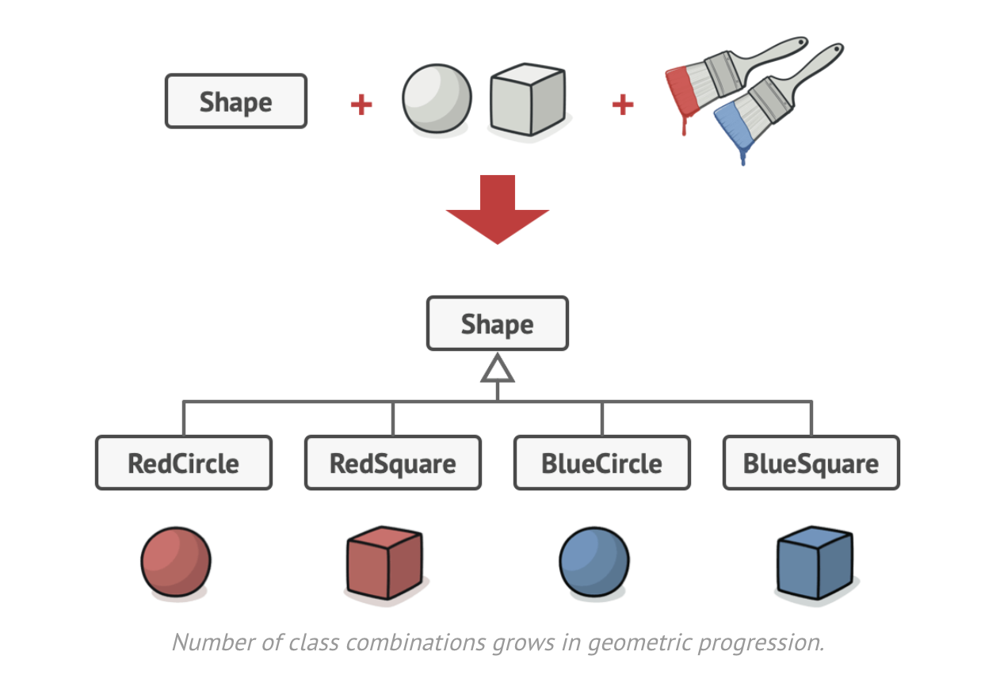

The Bridge pattern is a structural design pattern that allows you to separate a big class or set of related classes into two different domains: abstraction (also called interface) and implementation (also called platform).

The abstraction layer is the one that the client will use to interact with our application. This layer is not going to contain the business logic of our application. Instead, it will delegate the work to the implementation layer.

#### Applicability

Use the Bridge pattern when:
- you want to split a big class that has several variants of some   functionality into two different layers.
- you need to switch between different variants at runtime.

