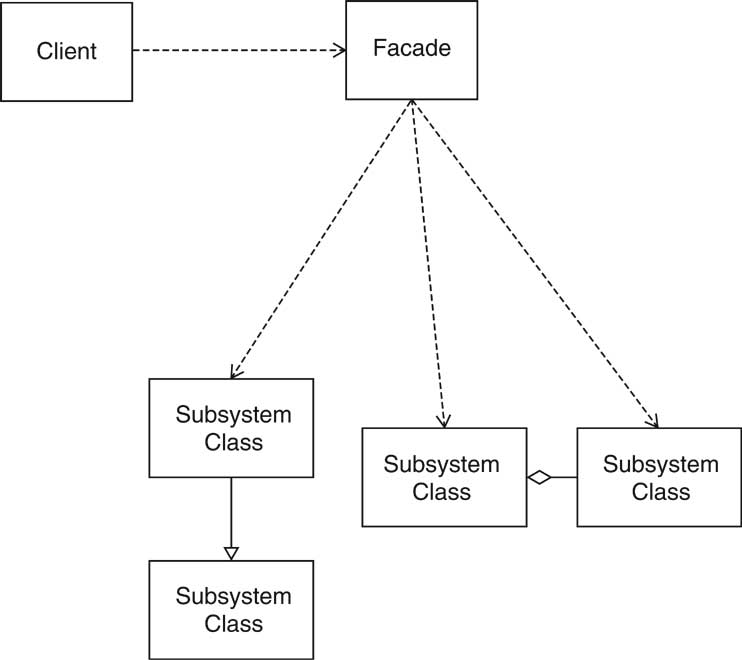

## Facade

A facade is a class that provides a simple interface to a complex subsystem which contains lots of moving parts. A facade might provide limited functionality in comparison to working with the subsystem directly. However, it includes only those features that clients really care about.

Having a facade is handy when you need to integrate your app with a sophisticated library that has dozens of features, but you just need a tiny bit of its functionality.

### Relations with Other Patterns
- Facade defines a new interface for existing objects, whereas Adapter tries to make the existing interface usable. Adapter usually wraps just one object, while Facade works with an entire subsystem of objects.

- Abstract Factory can serve as an alternative to Facade when you only want to hide the way the subsystem objects are created from the client code.

- Flyweight shows how to make lots of little objects, whereas Facade shows how to make a single object that represents an entire subsystem.

- Facade and Mediator have similar jobs: they try to organize collaboration between lots of tightly coupled classes.

- Facade defines a simplified interface to a subsystem of objects, but it doesn’t introduce any new functionality. The subsystem itself is unaware of the facade. Objects within the subsystem can communicate directly.
Mediator centralizes communication between components of the system. The components only know about the mediator object and don’t communicate directly.
A Facade class can often be transformed into a Singleton since a single facade object is sufficient in most cases.

- Facade is similar to Proxy in that both buffer a complex entity and initialize it on its own. Unlike Facade, Proxy has the same interface as its service object, which makes them interchangeable.