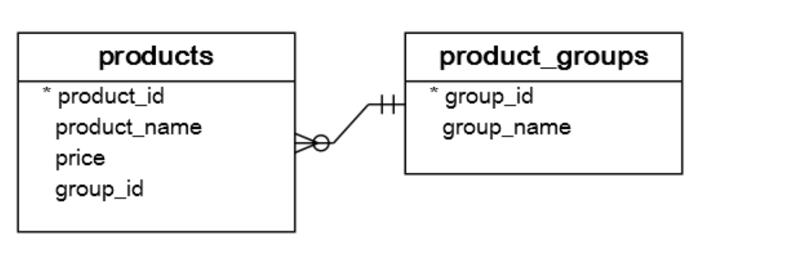

[Tutorial Link](https://www.postgresqltutorial.com/postgresql-window-function/)

## DB Scheme:


#### Create table:
```sql
CREATE TABLE product_groups (
    group_id serial PRIMARY KEY,
    group_name VARCHAR(255) NOT NULL
);

CREATE TABLE products (
    product_id serial PRIMARY KEY,
    product_name VARCHAR(255) NOT NULL,
    price DECIMAL(11, 2),
    group_id INT NOT NULL,
    FOREIGN KEY (group_id) REFERENCES product_groups (group_id)
);
```

#### Insert data:
```sql
INSERT INTO product_groups(group_name)
VALUES ('Smartphone'),
       ('Laptop'),
       ('Tablet');

INSERT INTO products (product_name, group_id, price)
VALUES ('Microsoft Lumia', 1, 200),
       ('HTC One', 1, 400),
       ('Nexus', 1, 500),
       ('iPhone', 1, 900),
       ('HP Elite', 2, 1200),
       ('Lenovo Thinkpad', 2, 700),
       ('Sony VAIO', 2, 700),
       ('Dell Vostro', 2, 800),
       ('iPad', 3, 700),
       ('Kindle Fire', 3, 150),
       ('Samsung Galaxy Tab', 3, 200);
```

### Simple aggregation:
```sql
SELECT AVG(price)
  FROM products;
```

### Aggregation for subset of rows:
```sql
SELECT group_name,
       AVG(price) as average_price
  FROM products
 INNER JOIN product_groups USING(group_id)
 GROUP BY group_name;
```

### Window function:
```sql
SELECT product_name,
       price,
       group_name,
       AVG(price) OVER (
        PARTITION BY group_name
        ORDER BY price DESC
       ) AS average_price,
       SUM(price) OVER (
        PARTITION BY group_name
        ORDER BY price DESC
       ) AS sum_price
  FROM products
 INNER JOIN product_groups USING(group_id);

--Shorter version with WINDOW clause:
SELECT product_name,
       price,
       group_name,
       AVG(price) OVER w AS average_price,
       SUM(price) OVER w AS sum_price
  FROM products
 INNER JOIN product_groups USING(group_id)
WINDOW w as (PARTITION BY group_name
                 ORDER BY price DESC);
```

## Window functions:

### ROW_NUMBER, RANK, DENSE_RANK
```sql
SELECT product_name,
       price,
       group_name,
       ROW_NUMBER() OVER w,
       RANK() OVER w,
       DENSE_RANK() OVER w
  FROM products
 INNER JOIN product_groups USING(group_id)
WINDOW w as (PARTITION BY group_name
                 ORDER BY price);
```


### FIRST_VALUE AND LAST_VALUE
```sql
SELECT product_name,
       price,
       group_name,
       LAST_VALUE(price) OVER w AS highest_price_per_group,
       FIRST_VALUE(price) OVER w AS lowest_price_per_group
  FROM products
 INNER JOIN product_groups USING(group_id)
WINDOW w as (PARTITION BY group_name
                 ORDER BY price RANGE BETWEEN UNBOUNDED PRECEDING
		                                      AND UNBOUNDED FOLLOWING);
-- we added the frame clause RANGE BETWEEN UNBOUNDED PRECEDING
-- AND UNBOUNDED FOLLOWING because by default the frame clause
-- is  RANGE BETWEEN UNBOUNDED PRECEDING AND CURRENT ROW.
```

### LAG, LEAD
```sql
SELECT product_name,
       price,
       group_name,
       LAG(price, 2) OVER w AS before_prev_price,
       LAG(price) OVER w AS prev_price,
       price - LAG(price) OVER w AS curr_prev_diff,
       LEAD(price) OVER w AS next_price
  FROM products
 INNER JOIN product_groups USING(group_id)
WINDOW w as (PARTITION BY group_name
                 ORDER BY price);
```